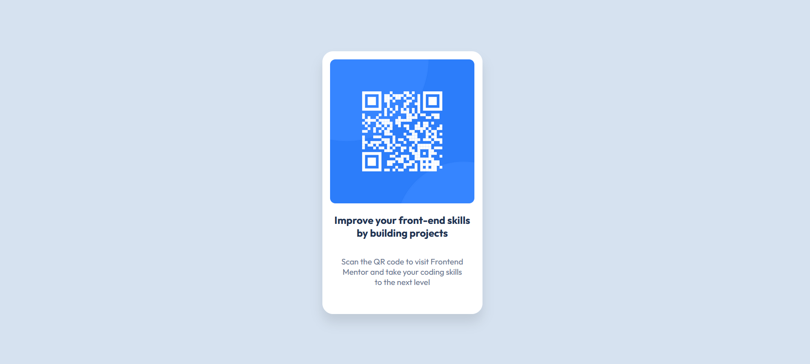

# Frontend Mentor - QR Code Component Solution

This is a solution to the [QR Code Component challenge on Frontend Mentor](https://www.frontendmentor.io/challenges/qr-code-component-iux_sIO_H).

## Table of Contents

- [Overview](#overview)
  - [Screenshot](#screenshot)
  - [Links](#links)
- [My Process](#my-process)
  - [Built With](#built-with)
  - [What I Learned](#what-i-learned)
  - [Continued Development](#continued-development)
  - [Useful Resources](#useful-resources)
- [Author](#author)
- [Acknowledgments](#acknowledgments)

## Overview

### Screenshot



A clean and simple QR code component designed with modern CSS practices.

### Links

- Solution URL: [Add solution URL here](https://your-solution-url.com)
- Live Site URL: [Add live site URL here](https://your-live-site-url.com)

## My Process

### Built With

- Semantic HTML5 markup
- CSS custom properties
- Flexbox
- Mobile-first workflow

### What I Learned

Through this project, I solidified my understanding of creating responsive layouts and how to effectively use Flexbox for centering and aligning content. Here are some key takeaways:

1. **CSS Grid vs Flexbox**: I learned when to use Flexbox for simple layouts and when a CSS Grid would be more appropriate. Flexbox worked well for aligning the QR code and the text, but I also considered the power of CSS Grid for more complex layouts.
2. **Mobile-First Approach**: By designing for mobile first, I ensured that the component is easily viewable on smaller screens. I leveraged `@media` queries to make the design responsive for larger screens.

Example of using Flexbox to center the content:

```css
.container {
  display: flex;
  justify-content: center;
  align-items: center;
  height: 100vh;
}
```

### Continued development

1. **Improving Accessibility**: I aim to ensure that all components I build are fully accessible. This includes adding more ARIA attributes and ensuring proper keyboard navigation.

2. **Enhancing Layouts**: I plan to explore more advanced layout techniques using CSS Grid for more complex designs.

### Useful resources

- [CSS Tricks - Flexbox](https://css-tricks.com/snippets/css/a-guide-to-flexbox/) - This guide helped me understand the nuances of Flexbox and how to apply it effectively.

- [MDN - CSS Grid](https://developer.mozilla.org/en-US/docs/Web/CSS/CSS_grid_layout) - An excellent resource for learning CSS Grid and when to use it in projects.

## Author

- Frontend Mentor - [@jojotjo](https://www.frontendmentor.io/profile/jojotjo)
- Twitter - [@jo_jot_jo](https://x.com/jo_jot_jo)

## Acknowledgments

Big thanks to the Frontend Mentor community for their helpful feedback and continuous inspiration. The design for this challenge was clear, and it was a great exercise in responsiveness and layout techniques.
